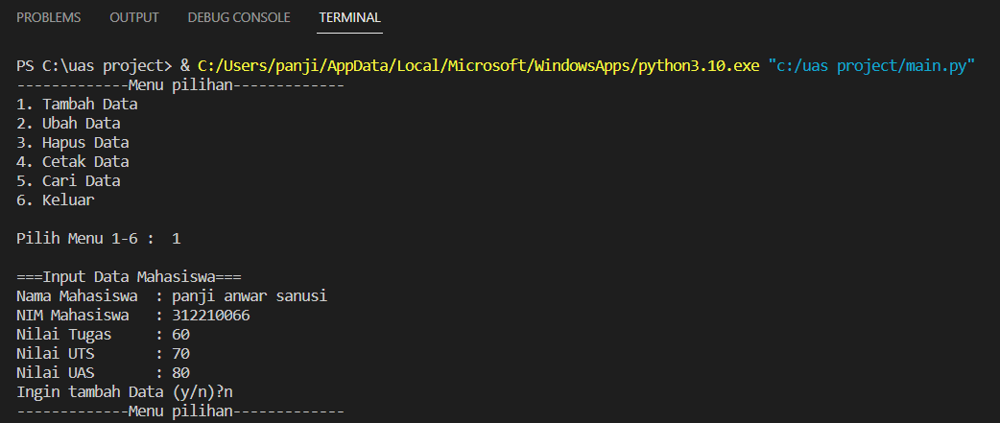

# UASbasprog

~~~bash
Nama    :Panji Anwar Sanusi

NIM     :312210066

Kelas   :TI.22.C1

Dosen   :Agung Nugroho S.Kom.,M.Kom
~~~

~~~bash
Link Youtube :
File pdf :
~~~

### main.py
~~~bash
main.py merupakan file utama yang menjalankan dan menjalankan method-method.

File ini berisi:

tampilkan.menu()
~~~

### modul view
~~~bash
Berisi 3 file, yaitu:

1. __init__.py sebagai deklarasi bahwa module View merupakan berbentuk module python, file ini dibiarkan kosong karena tidak digunakan sebagai penampung import packages dan function.

2. input_nilai.py berisi class data dan method-method yang digunakan untuk menerima inputan user.

3. view_nilai.py berisi class dan method yang digunakan untuk menampilkan table data.
~~~

### modul model

~~~bash
Berisi 2 file, yaitu:

1. __init__.py sebagai deklarasi bahwa module View merupakan berbentuk module python, file ini dibiarkan kosong karena tidak digunakan sebagai penampung import packages dan function.

2. daftar_nilai.py merupakan file services yang digunakan untuk menampung services/method yang digunakan untuk menambah data, update, delete, search, serta menampilkan table data.
~~~

### Hasil Run Program (Output)

- Menambahkan Data

- Menampilkan Data / Cetak Data

- Mengubah Data

- Mencari Data

- Keluar

~~~bash
TERIMA KASIH
~~~